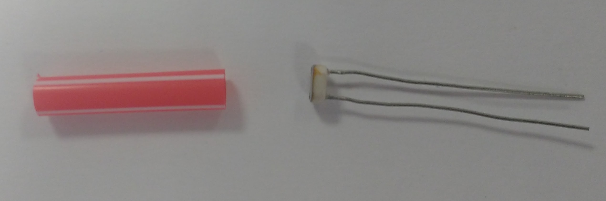
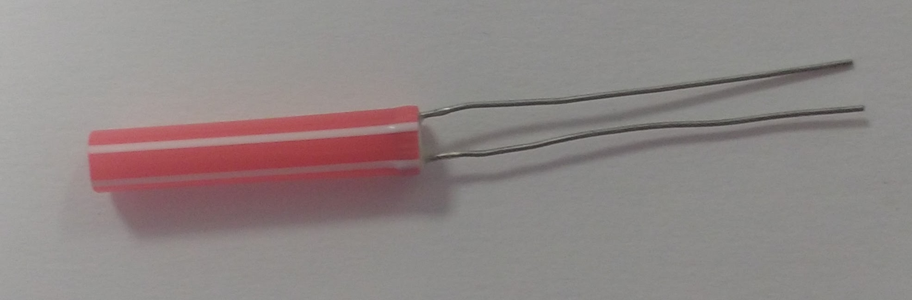
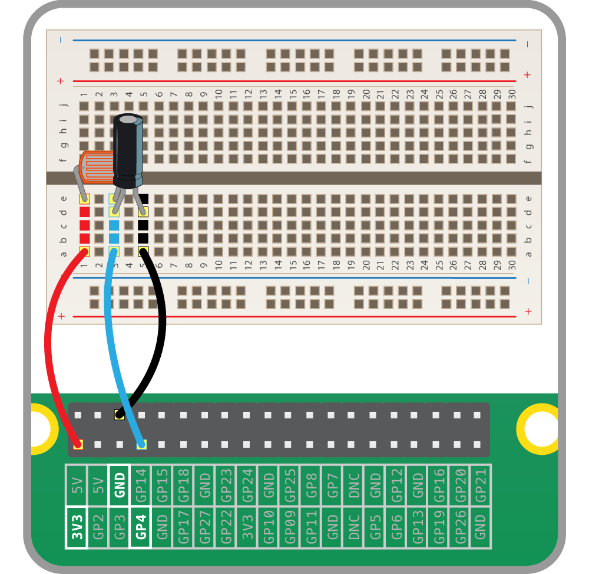

## Detecting a broken beam

Create a simple prototype on a breadboard to detect whether or not a beam of light is hitting the **l**ight-**d**ependent **r**esistor (LDR).

--- task ---

Shield your LDR to make sure that only light from the laser pointer will trigger your program. You can do this with a small roll of paper, or even more easily with a section of a drinking straw.





--- /task ---


Set up a **r**esistor-**c**apacitor circuit (RC circuit) using the 1µF capacitor and the LDR. 

--- task ---

Attach one leg of the LDR to a 3.3V pin (labeled **3V3**) of the Raspberry Pi. 

--- /task ---

--- task ---

Attach the other leg of the LDR to the positive leg of the capacitor.

--- /task ---

--- task ---

Connect the positive leg of the capacitor to a standard GPIO pin on the Raspberry Pi. 

--- /task ---

--- task ---

Attach the negative leg of the capacitor to a ground pin (labeled **GND**). 

--- /task ---

Here is one possible configuration of the circuit showing the positive leg of the capacitor attached to GPIO pin 4.



### The script on the Raspberry Pi

Write a script to detect when the laser beam is broken. You can use methods from the `gpiozero` module to do this.

--- task ---

Import the `LightSensor` class from `gpiozero`.

```python
from gpiozero import LightSensor
```
 
--- /task ---

--- task ---

Create an 'ldr' object for the GPIO pin to which you have connected the LDR.

```python
from gpiozero import LightSensor
ldr = LightSensor(4))
```

--- /task ---

--- task ---

Use the `when_dark` method to trigger your `print`. 

```python
from gpiozero import LightSensor
ldr = LightSensor(4))
ldr.when_dark = lambda: print("INTRUDER")
```

--- /task ---