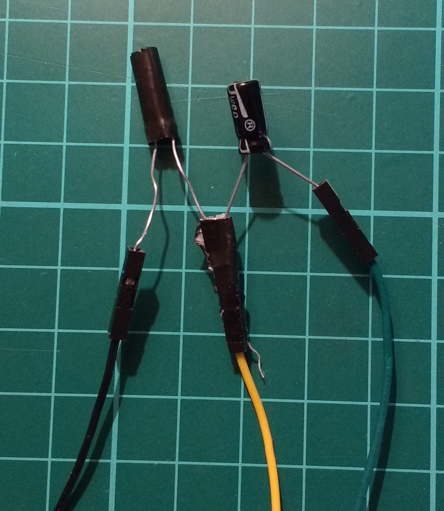
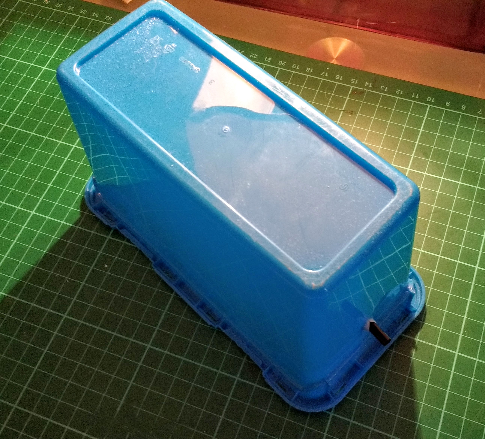

## Building your laser tripwire

Once the circuit has been tested, you can wire up the components directly to the Raspberry Pi.

--- task ---

Place one leg of the LDR and the long leg of the capacitor into a female-to-female jumper lead. Then tape it up to secure the legs.

--- /task ---

--- task ---

Place the remaining legs into jumper leads, then plug it all back into the Raspberry Pi.



--- /task ---

--- task ---

You can place the Raspberry Pi and components in a housing to conceal them if you wish. Here we have used a plastic box with a hole made in it for the straw:



--- /task ---

--- task ---

Place your container near a doorway. Then affix the laser pointer to the wall so the beam is focused down the straw.

--- /task ---

--- task ---

**Test**: Run the code and test your laser tripwire.

--- /task ---

### Run on boot

Your code needs to run as soon as the Raspberry Pi starts up. 

You can automate tasks with **Cron**.

--- task ---

Open Terminal and type:

```bash
crontab -e
```

--- /task ---

If this is your first time opening your crontab, then you'll be asked which text editor you would like to use.

--- task ---

When you see this, enter `1`

```bash
rpf@raspberrypi:~ $ crontab -e
no crontab for rpf - using an empty one

Select an editor.  To change later, run 'select-editor'.
  1. /bin/nano        <---- easiest
  2. /usr/bin/vim.tiny
  3. /bin/ed

Choose 1-3 [1]: 
```

--- /task ---

--- task ---

At the bottom of the crontab file, add this to a new line:

```bash
@reboot python3 /home/username/tripwire.py
```
--- /task ---

--- task ---

Save and exit nano by pressing `Ctrl + x` and then typing in `y` when you are prompted to save.

--- /task ---