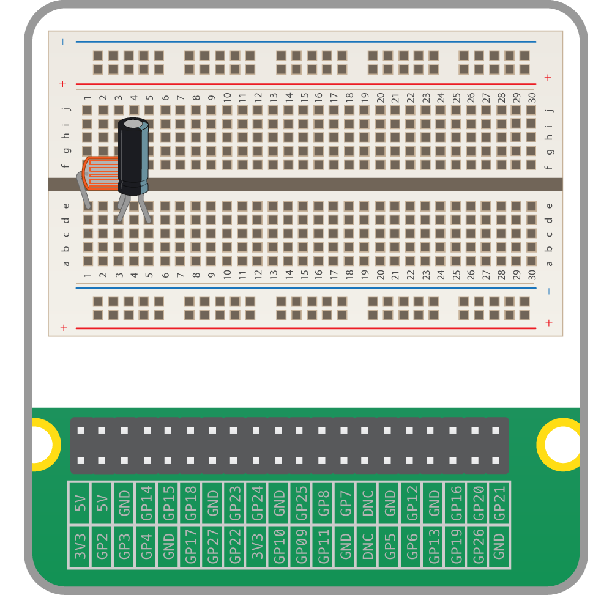
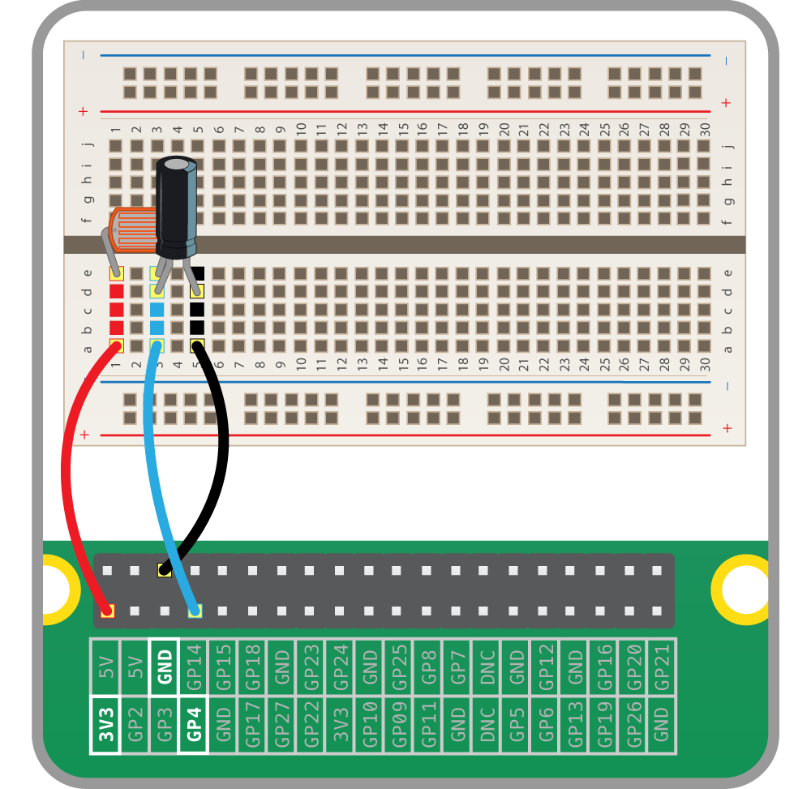

## Creating a light sensing circuit

To begin, you're going to create a light sensing circuit with your Raspberry Pi.

-  Place an LDR into your breadboard, as shown below:

-  Now place a capacitor in series with the LDR. As the capacitor is a polar component, you must make sure the long leg is on the same track as the LDR leg.

-  Finally, add jumper leads to connect the two components to your Raspberry Pi.

