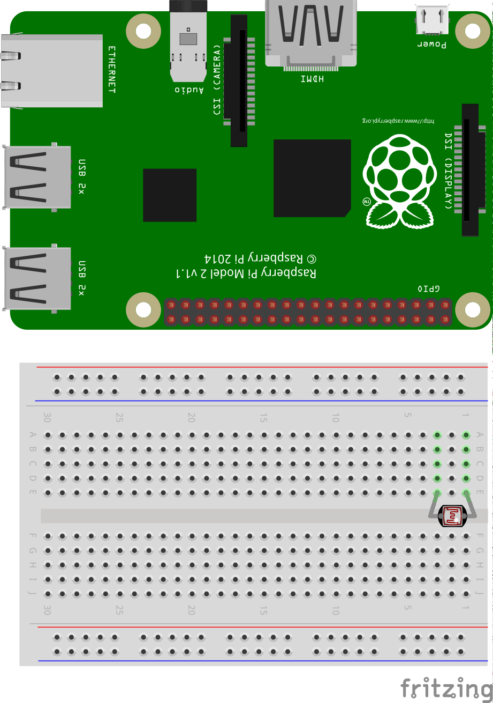
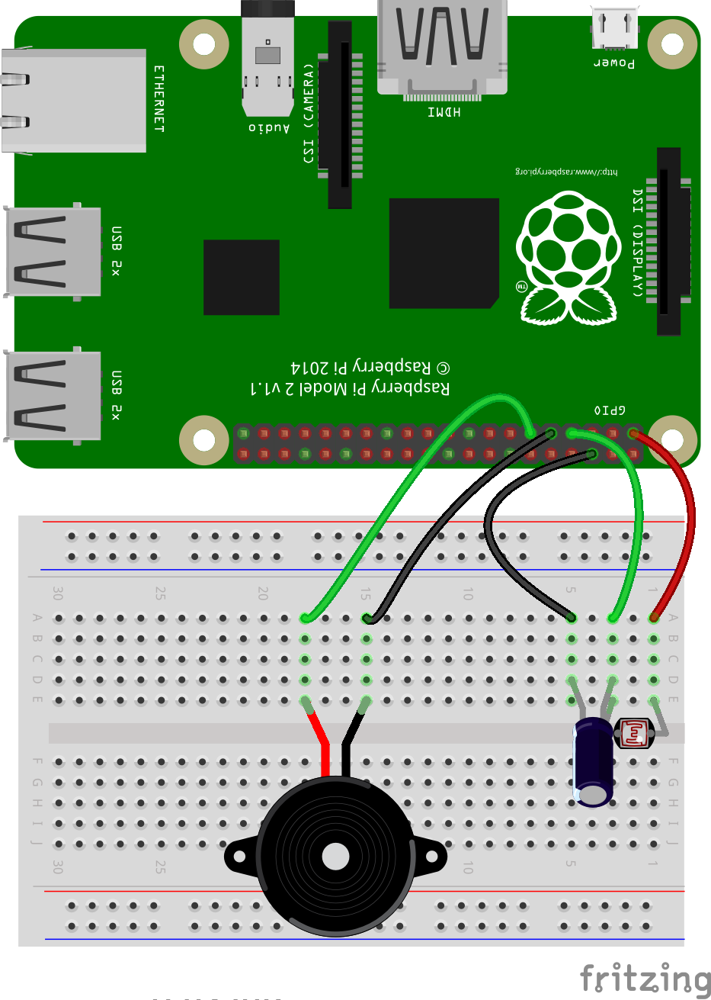

# A Raspberry Pi laser tripwire

In this resource you will be making a laser tripwire. This can be used as a way to catch unwanted intruders coming into your bedroom, or as a game to see if you can avoid triggering the trap.

## Analogue inputs

In the world of electrical engineering, there are two type of input and output (I/O): analogue and digital. Digital I/O is fairly easy to understand; it's either *on* or *off*, *1* or *0*.

When talking about voltages and the Raspberry Pi, any input that is approximately below 1.8V is considered *off* and anything above 1.8V is considered *on*. For output, 0V is off and 3.3V is on.

Analogue I/O is a little trickier. With an analogue input, we can have a range of voltages from 0V up to 3.3V, and the Raspberry Pi is unable to detect exactly what that voltage is.


How, then, can we use a Raspberry Pi to determine the value of an analogue input, if it can only tell when the voltage to a GPIO pin goes above 1.8V?

### Using a capacitor for analogue inputs

Capacitors are electrical components that store charge.


When current is fed into a capacitor it will begin to store charge. The voltage across the capacitor will start off low, and increase as the charge builds up.

By putting a resistor in series with the capacitor, you can slow the speed at which it charges. With a high resistance, the capacitor will charge slowly, whereas a low resistance will let it charge quickly.

If you time how long it takes the capacitor's voltage to get over 1.8V (or be *on*), you can work out the resistance of the component in series with it.

## Light-dependent resistors (LDRs)

An LDR (sometimes called a photocell) is a special type of resistor.


When light hits the LDR, its resistance is very low, but when it's in the dark its resistance is very high.

By placing a capacitor in series with an LDR, the capacitor will charge at different speeds depending on whether it's light or dark.

## Creating a light sensing circuit

To begin, you're going to create a light sensing circuit with your Raspberry Pi.

1.  Place an LDR into your breadboard, as shown below:



1.  Now place a capacitor in series with the LDR. As the capacitor is a polar component, you must make sure the long leg is on the same track as the LDR leg.


1.  Finally, add jumper leads to connect the two components to your Raspberry Pi.


## Coding a light sensor

Luckily, most of the complicated code you would have to write to detect the light levels received by the LDR has been abstracted away by the `gpiozero` library. This library will handle the timing of the capacitor's charging and discharging for you.

Use the following code to set up the light sensor:

```python
  from gpiozero import LightSensor, Buzzer

  ldr = LightSensor(4)  # alter if using a different pin
```

Now run the code and switch over to the interpreter. Type `ldr.value` into the interpreter to see the light level currently recorded. Next, shine the laser pointer onto the LDR and type `ldr.value` into the interpreter again, to see the light level when the LDR is illuminated.

## Reducing light to the LDR

You probably noticed that unless you are in a dark room, there is little difference in the measured light levels when the LDR is illuminated by the laser, and when it's not. This can be fixed by reducing the amount of light that the LDR receives from other light sources in the room.

1.  Take an opaque drinking straw and cut a length from it between 2 and
    5 cm long.
2.  Insert the head of the LDR into the straw.
3.  Type `ldr.value` into the interpreter again, then once more with the
    LDR illuminated by the laser.

You should now see a larger difference in the recorded light levels.

Wiring up the buzzer
--------------------

1.  The piezo buzzer is a polar component, like the capacitor. Place it into the breadboard, then connect the longer leg to GPIO 17 and the shorter leg into one of the ground pins.



## Testing the buzzer

Next you can test that the buzzer is working.

1.  Alter the `import` line so it looks like this, so you can access the `Buzzer` class from `gpiozero`:

```python
from gpiozero import LightSensor, Buzzer
```

1.  Next, you need to tell the program which pin the buzzer is connected to:

```python
buzzer = Buzzer(17)
```

1.  Your script should now look like this:

```python
  from gpiozero import LightSensor, Buzzer

  ldr = LightSensor(4)  # alter if using a different pin
  buzzer = Buzzer(17)  # alter if using a different pin

```

1.  Run your code and then in the interpreter type the following:

```python
buzzer.on()
# and
buzzer.off()
```

This will switch the buzzer on and off. If it's not working, check your wiring and pin numbers.

## The tripwire code

You need a loop to constantly check the light level hitting the LDR. As long as the light level is high, you can assume the laser beam has not been broken. When the light level drops, the beam has been broken and the buzzer should sound.

To do this you can use an infinite loop. This is a loop that will keep going until you quit the program:

```python
  from gpiozero import LightSensor, Buzzer

  ldr = LightSensor(4)  # alter if using a different pin
  buzzer = Buzzer(17)  # alter if using a different pin

  while True:
```

Within the loop, you can use conditional selection to see if the light level falls below some threshold value. Start with `0.5`, but adjust it if you need to increase or decrease the sensitivity of the system:

```python
  from gpiozero import LightSensor, Buzzer

  ldr = LightSensor(4)  # alter if using a different pin
  buzzer = Buzzer(17)  # alter if using a different pin

  while True:
      if ldr.value < 0.5:  # adjust this to make the circuit more or less sensitive
          buzzer.on()
      else:
          buzzer.off()
```

If you were to run this now, it would fail. This is because the `while` loop runs so many times a second, it checks the light level faster than the capacitor charges and discharges. To slow the script down, you'll need to use the `time` library and add a `sleep` into the loop:

```python
  from gpiozero import LightSensor, Buzzer
  from time import sleep

  ldr = LightSensor(4)  # alter if using a different pin
  buzzer = Buzzer(17)  # alter if using a different pin

  while True:
      sleep(0.1)
      if ldr.value < 0.5:  # adjust this to make the circuit more or less sensitive
          buzzer.on()
          # uncomment the next line to have the alarm trigger for 30 seconds.
          # sleep(30) 
      else:
          buzzer.off()
```

Run the code and shine the laser onto the LDR. When you break the beam, the buzzer should sound.

## Packaging it all up

Once the circuit has been tested, you can wire up the components directly to the Raspberry Pi as shown below.

1.  Place a leg of the LDR and the long leg of the capacitor into a female-to-female jumper lead, then tape it up.

1.  Place jumper leads on the remaining legs, then plug it all back into the Raspberry Pi.


You can place the Raspberry Pi and components in a housing to conceal them if you wish. Here we have used a plastic box with a hole made in it for the straw:


1.  Place your container near a doorway and then affix the laser pointer to the wall, so the beam is focused down the straw.
1.  Now run the code and test your laser tripwire.
